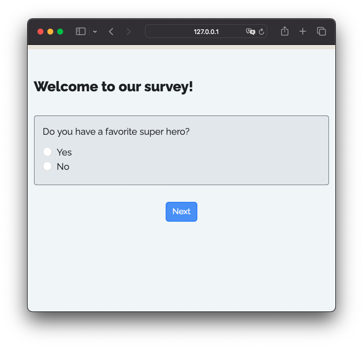

```{r setup, child="../setup.Rmd"}
```

---

# Meet your instructor!

.leftcol30[.circle[


]]

.rightcol70[

### John Helveston, Ph.D.

.font80[

Associate Professor, Engineering Management & Systems Engineering

- 2016-2018 Postdoc at [Institute for Sustainable Energy](https://www.bu.edu/ise/), Boston University
- 2016 PhD in Engineering & Public Policy at Carnegie Mellon University
- 2015 MS in Engineering & Public Policy at Carnegie Mellon University
- 2010 BS in Engineering Science & Mechanics at Virginia Tech
- Website: [www.jhelvy.com](http://www.jhelvy.com/)

]]

---

class: center

# Meet the dev team!

.cols3[.circle[

<center>

<br>
<b>John Paul Helveston</b>
</center>

]]

.cols3[.circle[

<center>

<br>
<b>Pingfan Hu</b>
</center>

]]

.cols3[.circle[

<center>

<br>
<b>Bogdan Bunea</b>
</center>

]]

---

# Before we start...

<br>

## 1. Be sure to [install everything](https://jhelvy.github.io/2025-qux-surveydown-workshop/install.html)

## 2. Download the [examples](https://jhelvy.github.io/2025-qux-surveydown-workshop/examples.zip)

---

class: center, middle, inverse

# .font150[.fancy[`r rmarkdown::metadata$title`]]

---

class: center, middle, inverse

<center>

</center>

---

class: center, middle

.font150[**WYSIWYG Interface**]

<center>

</center>

---

class: middle

.leftcol65[

<center>

</center>

]

.rightcol35[

# Limitations

<br>

## .font80[❌] .font90[Reproducibility]

]

---

class: middle

.leftcol65[

<center>

</center>

]

.rightcol35[

# Limitations

<br>

## .font80[❌] .font90[Reproducibility]

## .font80[❌] .font90[Version control]

]

---

<center>

</center>

---

class: middle

.leftcol65[

<center>

</center>

]

.rightcol35[

# Limitations

<br>

## .font80[❌] .font90[Reproducibility]

## .font80[❌] .font90[Version control]

## .font80[❌] .font90[Limited features]

]

---

class: middle

.leftcol65[

<center>

</center>

]

.rightcol35[

# Limitations

<br>

## .font80[❌] .font90[Reproducibility]

## .font80[❌] .font90[Version control]

## .font80[❌] .font90[Limited features]

## .font80[❌] .font90[Open source]

]

---

class: inverse, middle

# .center[Why not make surveys from code?]

---

class: inverse, middle

.leftcol[

<br><br><br><br><br>

# .center[Why not make surveys from code?]

]

.rightcol45[

<br>

# ~~Limitations~~ Features

## ✅ Reproducibility

## ✅ Version control

## ✅ Lots of features

## ✅ Open source

]

---

class: middle, inverse

# .font130[.center[Introducing surveydown!]]

<br>
<center>

</center>

---

```{r child="topics/1.Rmd"}
```

---

background-image: url("images/images/Slide1.png")
background-size: cover

---

name: whatis
class: center, middle, inverse

# .font140[.center[What is Quarto?]]

---

class: center, middle

# Quarto is a publishing system that blends **markdown-formatted text** & **code**

<center>

</center>

---

.leftcol[

.center[.font100[**example.qmd**]]

.code70[

````{markdown}
---
format: html
title: "HTML Page with R Code"
---

# Hello, World!

This is a simple **HTML** page with *R* code.

```{r}
library(ggplot2)

df <- data.frame(x = rnorm(100))
ggplot(df, aes(x = x)) +
  geom_histogram()
```
````

]]

.rightcol[

.center[.font100[**Rendered output**]]

<center>

</center>

]

---

.leftcol[.code60[

````{markdown}
---
format: html
echo: false
warning: false
---

```{r}
library(surveydown)
```

--- welcome

# Welcome to our survey!

```{r}
sd_question(
  type  = "mc",
  id    = "penguins",
  label = "What's your favorite penguin?",
  option = c(
    "Adélie"    = "adelie",
    "Chinstrap" = "chinstrap",
    "Gentoo"    = "gentoo"
  )
)

sd_next()
```

--- end

This is the last page of the survey.

```{r}
sd_close()
```

````

]]

.rightcol[

# .center[survey.qmd]

]

---

.leftcol[.code60[

````{markdown}
--- #<<
format: html #<<
echo: false #<<
warning: false #<<
--- #<<

```{r} #<<
library(surveydown) #<<
``` #<<

--- welcome

# Welcome to our survey!

```{r}
sd_question(
  type  = "mc",
  id    = "penguins",
  label = "What's your favorite penguin?",
  option = c(
    "Adélie"    = "adelie",
    "Chinstrap" = "chinstrap",
    "Gentoo"    = "gentoo"
  )
)

sd_next()
```

--- end

This is the last page of the survey.

```{r}
sd_close()
```

````

]]

.rightcol[

YAML Header 

<br>
Load `surveydown` package

]

---

.leftcol[.code60[

````{markdown}
---
format: html
echo: false
warning: false
---

```{r}
library(surveydown)
```

--- welcome #<<

# Welcome to our survey!

```{r}
sd_question(
  type  = "mc",
  id    = "penguins",
  label = "What's your favorite penguin?",
  option = c(
    "Adélie"    = "adelie",
    "Chinstrap" = "chinstrap",
    "Gentoo"    = "gentoo"
  )
)

sd_next()
```

--- end #<<

This is the last page of the survey.

```{r}
sd_close()
```

````

]]

.rightcol[

Define page breaks like this:

````{markdown}
--- page_id

Page content

````

]

---

.leftcol[.code60[

````{markdown}
---
format: html
echo: false
warning: false
---

```{r}
library(surveydown)
```

--- welcome

# Welcome to our survey! #<<

```{r} #<<
sd_question( #<<
  type  = "mc", #<<
  id    = "penguins", #<<
  label = "What's your favorite penguin?", #<<
  option = c( #<<
    "Adélie"    = "adelie", #<<
    "Chinstrap" = "chinstrap", #<<
    "Gentoo"    = "gentoo" #<<
  ) #<<
) #<<

sd_next() #<<
``` #<<

--- end

This is the last page of the survey.

```{r}
sd_close()
```

````

]]

.rightcol[

<br><br><br><br><br><br>Use markdown for page content

Use `sd_question()` in code chunk for survey questions

<br><br>Use `sd_next()` for next button

]

---


.leftcol[.code60[

````{markdown}
---
format: html
echo: false
warning: false
---

```{r}
library(surveydown)
```

--- welcome

# Welcome to our survey! #<<

```{r} #<<
sd_question( #<<
  type  = "mc", #<<
  id    = "penguins", #<<
  label = "What's your favorite penguin?", #<<
  option = c( #<<
    "Adélie"    = "adelie", #<<
    "Chinstrap" = "chinstrap", #<<
    "Gentoo"    = "gentoo" #<<
  ) #<<
) #<<

sd_next() #<<
``` #<<

--- end

This is the last page of the survey.

```{r}
sd_close()
```

````

]]

.rightcol[

<br>

<center>

</center>

]

---

class: center, middle, inverse

# .font120[.center[Use Shiny to drive the web app]]

<br>

<center>

</center>

---

class: center

# Survey Components

<br>

.leftcol45[

### `survey.qmd`

A **Quarto doc** defining the main survey content (pages, text, images, questions, etc).


]

.rightcol45[

### `app.R`

An **R script** defining the survey Shiny app. It sets up the database and server, and launches the survey.

]

---

class: middle

.leftcol[.code70[

```{r}
#| eval: false

library(surveydown)

# Connects to database
db <- sd_db_connect()

# Main UI
ui <- sd_ui()

server <- function(input, output, session) {

  # Main server
  sd_server(db)
  
}

shiny::shinyApp(
  ui = ui, 
  server = server
)
```

]]

.rightcol[

# .center[app.R]

]

---

class: middle

.leftcol[.code70[

```{r}
#| eval: false

library(surveydown) #<<

# Connects to database
db <- sd_db_connect() #<<

# Main UI
ui <- sd_ui() #<<

server <- function(input, output, session) {
  
  # Main server
  sd_server(db) #<<

}

shiny::shinyApp(
  ui = ui,
  server = server
)
```

]]

.rightcol[

Load package

Connect to database

Make standard UI 

<br>Run surveydown server

]

---

class: inverse

```{r, echo=FALSE}
countdown(
  minutes   = 5,
  top       = 0,
  right     = 0,
  font_size = '2em'
)
```

# Your turn - start with a [template](https://surveydown.org/templates)

**Step 1:** In R console, run:

```{r}
#| eval: false

surveydown::sd_create_survey()
```

*Optional*: Specify a `path` and / or a `template`:

```{r}
#| eval: false

surveydown::sd_create_survey(
  template = "question_types",
  path     = "path/to/folder"
)
```

**Step 2:** In your IDE, open the `app.R` file, click "Run App", or in R console run:

```{r}
#| eval: false

shiny::runApp('app.R')
```

---

```{r child="topics/2.Rmd"}
```

---

## YAML Header

The YAML header is at the top of the `.qmd` file:

``` yaml
---
format: html
echo: false
warning: false
---
```

---

## Change the survey theme 

Pick a different [bootswatch theme](https://bootswatch.com) with the `theme` key:

```{markdown}
---
format: html
echo: false
warning: false
theme: united #<<
---
```

Make a custom theme with a `custom.scss` file

```{markdown}
---
format: html
echo: false
warning: false
theme: [united, custom.scss] #<<
---
```

---

## Progress bar

You can modify the survey progress bar with the `barcolor` and `barposition` keys:

.leftcol[

Change to any color with `barcolor`:

```{markdown}
---
format: html
echo: false
warning: false
barcolor: #768692 #<<
---
```

]

.rightcol[

Change position: `top`, `bottom`, or `none`

```{markdown}
---
format: html
echo: false
warning: false
barposition: bottom #<<
---
```

]

---

# Inserting pages

Insert new pages with the shorthand syntax using three dashes `---` followed by the page ID:

```{r}
#| eval: false

--- page1

Page 1 content here

--- page2

Page 2 content here

```

---

# Inserting next buttons

Insert buttons with the `sd_next()` function to go to the next page:

````markdown
`r ''````{r}
sd_next()
```
````

Specify a specific page to go to: 

````markdown
`r ''````{r}
sd_next('next_page_id')
```
````

---

# Inserting questions

Insert questions using the `sd_question()` function, like this:

.leftcol[

**Code**

```{r}
#| eval: false

sd_question(
  type   = 'mc',
  id     = 'fruit',
  label  = "1. Do you like fruit?",
  option = c(
    'Yes!'    = 'yes',
    'Kind of' = 'kind_of',
    'No :('   = 'no'
  )
)
```

Format is `"Label = value"`

]

.rightcol[

**Output**

```{r}
#| echo: false

sd_question(
  type   = 'mc',
  id     = 'fruit',
  label  = "1. Do you like fruit?",
  option = c(
    'Yes!'    = 'yes',
    'Kind of' = 'kind_of',
    'No :('   = 'no'
  )
)
```

**Data**

`yes`, `kind_of`, or `no`

]

---

## surveydown supports lots of [question types](https://surveydown.org/docs/question-types)

Some common types you may want to use:

Type | Description
-----|---------------------
`mc` | Multiple choice question (single choice) 
`mc_multiple` | Multiple choice question (multiple choices) 
`mc_buttons` | Multiple choice question (large buttons)
`select` | Drop down menu (choose one)
`text` | Open text, single row
`textarea` | Open text, block

---

# Embed images with html

I recommend just writing html code, like this

```{html, eval=FALSE}
<center>

</center>
```

<center>

</center>

---

# Embed images with markdown

```{html, eval=FALSE}
{fig-align="center" width="250"}
```

<center>

</center>

---

class: center, middle

# Try out the surveydown [studio app](https://github.com/surveydown-dev/sdstudio)

## `sdstudio::launch()`

---

class: inverse

```{r, echo=FALSE}
countdown(
  minutes   = 10,
  top       = 0,
  right     = 0,
  font_size = '2em'
)
```

## Your turn

- Open and edit the `survey.qmd` file that you previously made.
- Pick a topic for your survey (a food, an animal, a sports team...whatever).
- Draft a survey about that topic. Include the following:
    - Page 1: A welcome message in large font ("Welcome to a survey about [topic]") and an image about the topic (find an image somewhere).
    - Pages 2 to N: Add different questions about the topic using several different question types.
- Try out different themes to change the look and feel. 

## OR:

Open and play with the examples:

- `part-1-question-types`
- `part-1-question-yml`
